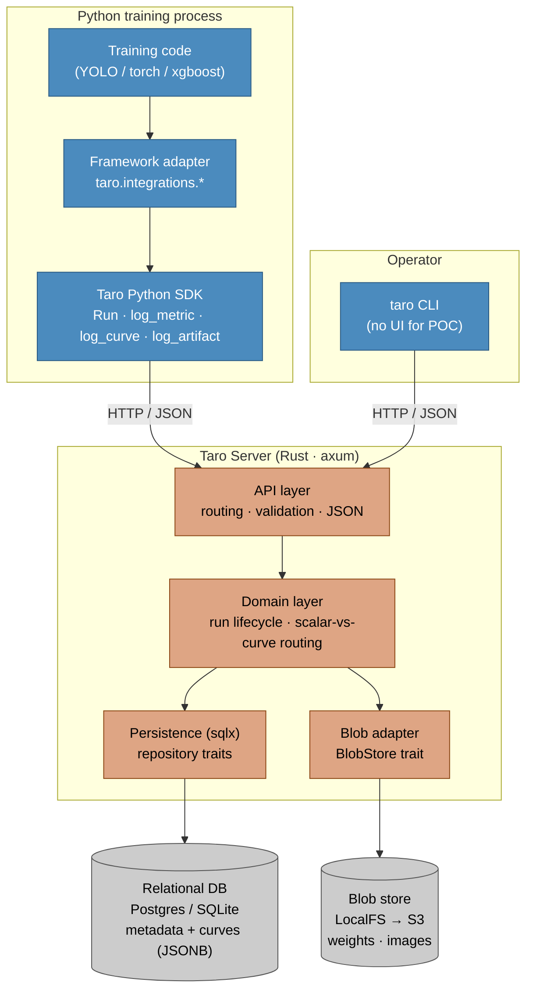
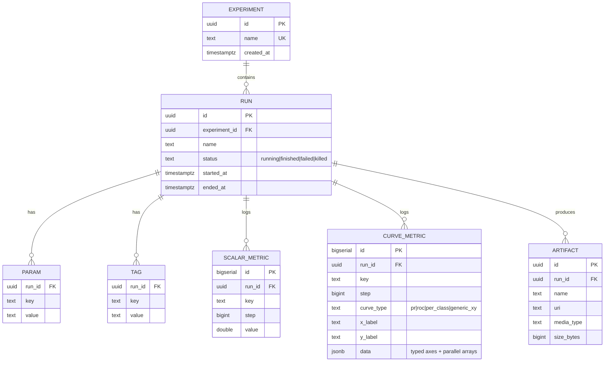
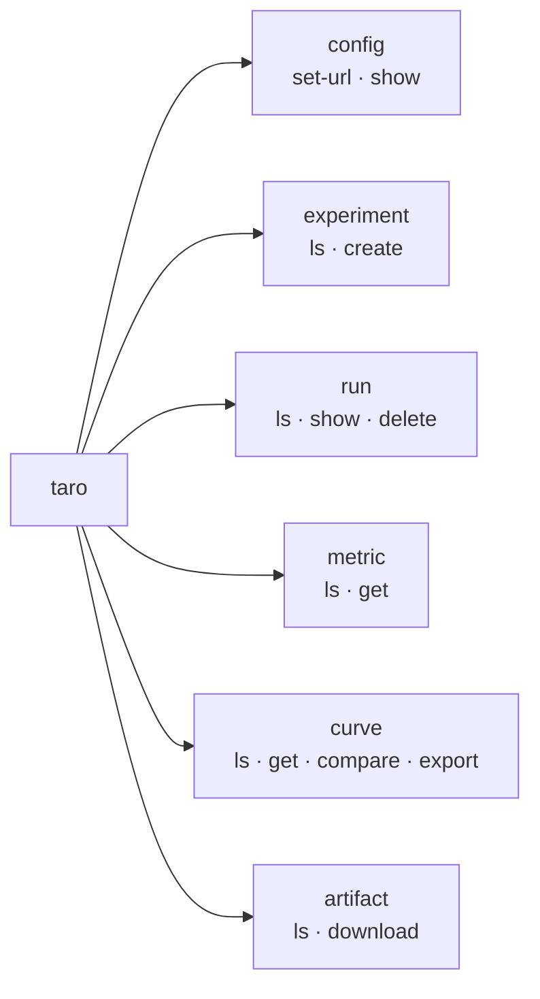

# Taro — System Visualization & CLI Design (POC)

Self-hosted, curve-native experiment tracker. Rust storage + REST API, thin Python client, simple CLI instead of a UI for the POC.

> **Differentiator:** a metric value can be a *curve/vector*, not just a scalar. PR curves and per-class AP are stored as data and are overlayable across runs — the one thing MLflow can't do.

---

## 1. System Architecture



The server is **framework-agnostic**: it only knows `experiment / run / metric / curve / param / tag / artifact`. All ML-specific logic lives in the Python adapters.

---

## 2. Data Model (ER)



`SCALAR_METRIC` and `CURVE_METRIC` are deliberately **separate tables** (many tiny rows vs few fat rows; different access patterns).

> **Confusion matrix:** confirmed out of scope for the POC. When added it becomes its **own `curve_type` ("confusion")** with a 2D `matrix` + `labels` payload — it does not fit the x/y-array shape, so it is intentionally deferred, not forced into `curve_metric`.

---

## 3. Run Logging Sequence (the curve path)

```mermaid
sequenceDiagram
    participant T as YOLO training
    participant A as taro.integrations.ultralytics
    participant S as Taro SDK
    participant API as Taro Server
    participant DB as DB
    participant B as Blob store

    T->>S: start_run(experiment, params)
    S->>API: POST /runs
    API->>DB: insert run (status=running)
    API-->>S: run_id

    loop each epoch (on_fit_epoch_end)
        T->>A: trainer (metrics + curves)
        A->>S: log_metrics(mAP50, ...) ; log_curve("pr_curve", x,y)
        S->>API: POST /runs/{id}/metrics  (batched scalars)
        S->>API: POST /runs/{id}/curves   (curve as DATA)
        API->>DB: insert scalar rows + curve_metric JSONB
    end

    T->>A: on_train_end (best.pt)
    A->>S: log_artifact("best.pt")
    S->>API: POST /runs/{id}/artifacts (multipart)
    API->>B: store bytes
    API->>DB: insert artifact (uri only)
    A->>S: finish(status=finished)
    S->>API: PATCH /runs/{id}
    API->>DB: update status, ended_at
```

The overlay/compare read path is a single endpoint:
`GET /curves/compare?run_ids=A,B&key=pr_curve` → returns each run's curve **as data, never an image**.

---

## 4. CLI Design (`taro`)

No frontend for the POC, so the CLI is the operator interface to inspect and compare runs. It is a **thin HTTP client over the same REST API** the SDK uses — it holds no logic of its own. Ships as part of the Python client package (`taro.cli`), so one `pip install` gives both logging and inspection. (A Rust binary is an option later; Python keeps the POC fast.)

### Command tree



### Commands

| Command | Purpose |
|---|---|
| `taro config set-url http://localhost:8080` | Point CLI at a server (stored in `~/.taro/config.toml`). |
| `taro experiment ls` | List experiments with run counts. |
| `taro run ls -e <exp> [--status finished] [--sort mAP50]` | List runs, filter/sort by metric. |
| `taro run show <run_id>` | Run detail: params, tags, latest scalars, available curves, artifacts. |
| `taro metric get <run_id> --key mAP50` | Print a scalar series (step,value) as table/json. |
| `taro curve ls <run_id>` | List curve keys + steps available for a run. |
| `taro curve get <run_id> --key pr_curve [--step latest]` | Fetch one curve's points. |
| `taro curve compare --runs A,B,C --key pr_curve [--step latest]` | **The headline command** — fetch N runs' curves side by side. |
| `taro curve export --runs A,B --key pr_curve -o pr.csv` | Dump comparable curve data to CSV/JSON for plotting in a notebook. |
| `taro artifact ls <run_id>` / `download <run_id> --name best.pt` | List / pull artifacts by URI. |

### Output conventions
- Default human-readable tables; `--json` on every command for piping/scripting.
- `curve compare` / `curve export` are how you actually *see* overlaid curves without a UI: export → plot in matplotlib/notebook. This closes the POC's "no frontend" gap.
- Global flags: `--url` (override config), `--json`, `--quiet`.

### Example session

```
$ taro run ls -e yolo-vehicle --sort mAP50
RUN_ID    NAME            STATUS    mAP50   mAP50-95
a1b2…     yolov8n-aug-v3  finished  0.643   0.451
c3d4…     yolov8n-base    finished  0.610   0.420

$ taro curve compare --runs a1b2,c3d4 --key pr_curve --step latest -o pr.json
wrote 2 curves (recall × precision) to pr.json   # plot in a notebook
```

---

## 5. YOLO Adapter Validation

The highest integration risk is extracting PR / per-class curves from Ultralytics, whose attribute paths vary by version. Before building the adapter, run the probe:

```
python scripts/validate_yolo_adapter.py          # introspect val() metrics + curves
python scripts/validate_yolo_adapter.py --train  # also probe the on_fit_epoch_end trainer object
```

It downloads `yolov8n.pt` + the tiny `coco8` dataset, runs validation, and reports — per field Taro needs — the exact attribute path, type, and shape, with a PASS/FAIL summary. See `scripts/validate_yolo_adapter.py`. Run it in your training environment (Ultralytics is not installed in the design env).
